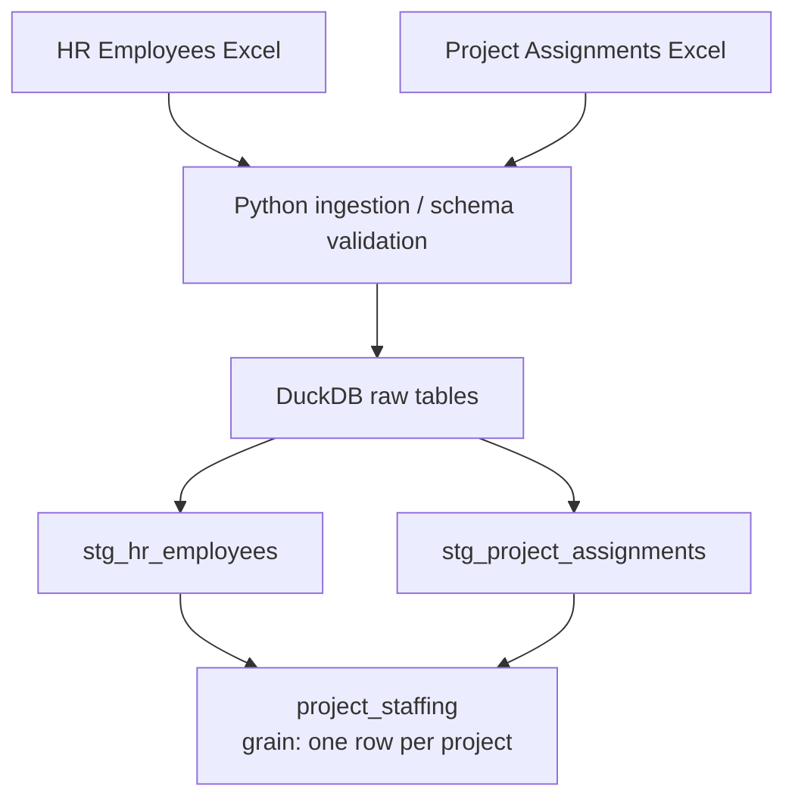

# Project Staffing Pipeline

## Overview

This pipeline turns two HR Excel exports into `project_staffing`: project code,
name, assigned leads, distinct active team size, and total active weekly hours.

## Architecture



Python owns file ingestion, schema validation, canonical column names, and
idempotent loading. dbt owns cleaning, type normalization, business logic, and tests.

DuckDB fits these local exports without a persistent database service and works
naturally with Python and dbt.

## How to run

The complete workflow requires only Docker:

```bash
docker build -t data-engineer-task .
docker run --rm data-engineer-task
```

The image installs locked dependencies with uv. The container ingests both files,
runs `dbt build`, and prints JSON with full lead names and explicit nulls.

For local development with Python 3.12 and uv installed:

```bash
uv sync
uv run pytest
uv run ingest-staffing
uv run dbt build --profiles-dir .
uv run dbt show --profiles-dir . --select project_staffing --limit 100 --output json
```

The default local database path is `warehouse/staffing.duckdb`. Set
`DUCKDB_PATH` to override it for dbt, and pass the same path to
`ingest-staffing --database` when using a custom location.

## Data model

| Layer | Model | Grain | Responsibility |
|---|---|---|---|
| Raw | `raw.hr_employees` | Employee export row | Preserve source values as text and row lineage |
| Raw | `raw.project_assignments` | Assignment export row | Preserve source values as text and row lineage |
| Staging | `stg_hr_employees` | One row per employee | Clean strings, parse dates, standardize status |
| Staging | `stg_project_assignments` | One row per assignment | Clean strings, parse dates/hours, normalize roles and billable values |
| Mart | `project_staffing` | One row per project | Aggregate leads and active staffing metrics |

`project_code` is unique in the mart, so project-level joins do not multiply its metrics.

## Data quality and assumptions

| Decision | Behaviour |
|---|---|
| Source lineage | Raw and staging retain filename, row number, and `_source_snapshot_date` as a date. Snapshot metadata is required: HR `Generated:` uses `YYYY-MM-DD`; assignment `Report Date:` is assumed to use `DD/MM/YYYY`. It does not affect staffing logic. |
| Billable mapping | `Y` / `Yes` → `true`; `N` / `No` → `false`. |
| Multiple or missing leads | Keep all leads, separated by semicolons and ordered by employee ID; no lead produces `NULL`. |
| Active staffing | HR `Status` is authoritative. Only active employees contribute to metrics; inactive assignments remain in staging. |
| Inactive lead | Retain the assigned lead. Project 006 keeps Matthew Davis with zero team size and hours. |
| Employment-date anomalies | Preserve assignments starting after termination; do not override status with inferred date rules. |
| Capacity review | Warn when an active employee's total weekly hours across all assignments exceeds 40. This employee-level heuristic is not a per-assignment constraint; records and metrics are unchanged. Warnings are expected on the supplied data. |
| Source preservation | Retain unusual email conventions and job titles without inventing correction rules. |

## Testing

| Tests | Guarantees |
|---|---|
| Python | Dynamic header discovery, sheet/schema validation, canonical mapping, loading, idempotency, and snapshot preservation after invalid input |
| dbt unit | Synthetic examples verify lead handling, distinct team size, assignment-hour sums, and billable mapping |
| dbt data | Keys, required fields, domains, employee relationships, date parsing, consistent project names, project preservation, and non-negative/reconciled metrics |
| Capacity warning | Active employee totals above 40 hours are reported for review without failing the pipeline |

## Possible enrichments / future enhancements

The employee relationship could support participating departments, department
count, and other staffing-composition metrics at project level. These are
intentionally outside the current mart so it stays focused on the requested
staffing measures.

## Production considerations

A production version could read versioned exports from object storage, load a
managed warehouse such as BigQuery, run through a scheduler, and add monitoring,
alerting, and source-contract checks. Incremental ingestion would be appropriate
if volume or history requirements justified it. Those components are deliberately
not included in this local take-home implementation.
